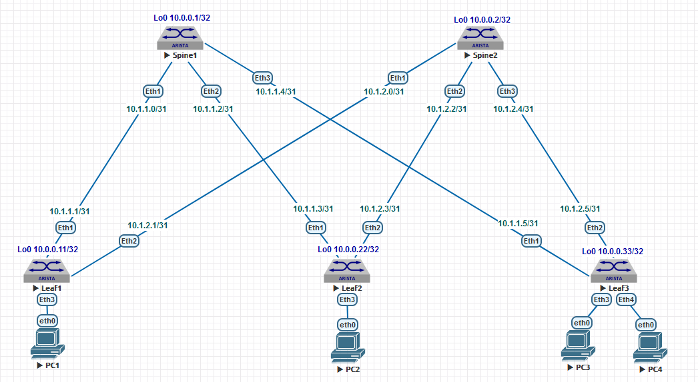

## Домашнее задание №1

### Схема сети.

### План адресации.

#### Loopbacks

| Hostname | Loopback0    | Loopback1     |
| :------: | :-----------:|:-------------:|
|  Spine1  | 10.0.0.1/32  | 10.0.0.101/32 |
|  Spine2  | 10.0.0.2/32  | 10.0.0.102/32 |   
|  Leaf1   | 10.0.0.11/32 | 10.0.0.111/32 |    
|  Leaf2   | 10.0.0.22/32 | 10.0.0.122/32 |         
|  Leaf3   | 10.0.0.33/32 | 10.0.0.133/32 |  

#### P2P
