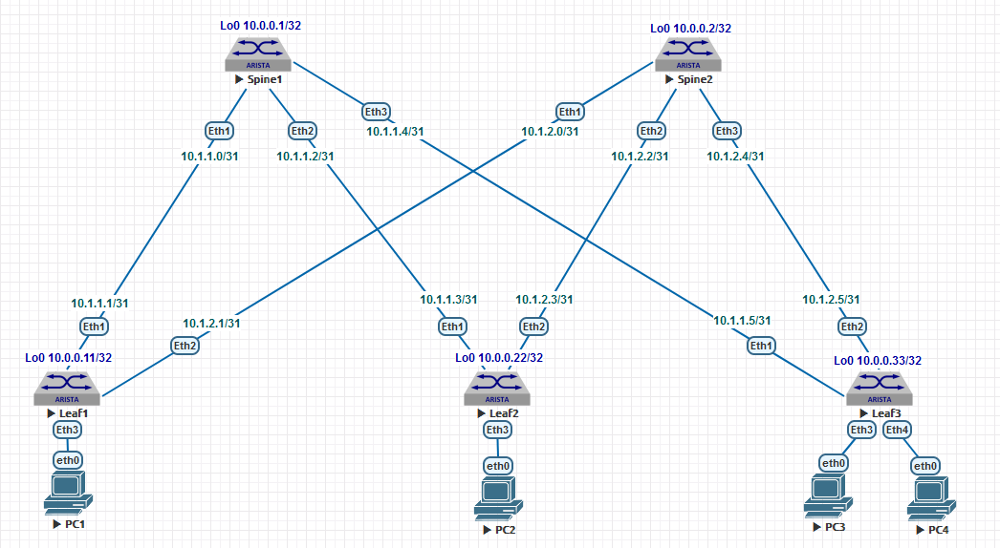

## Домашнее задание №2

### Схема сети.

### План адресации.

#### Loopbacks

| Hostname | Loopback0    | Loopback1     |
| :------: | :-----------:|:-------------:|
|  Spine1  | 10.0.0.1/32  | 10.0.0.101/32 |
|  Spine2  | 10.0.0.2/32  | 10.0.0.102/32 |
|  Leaf1   | 10.0.0.11/32 | 10.0.0.111/32 |
|  Leaf2   | 10.0.0.22/32 | 10.0.0.122/32 |
|  Leaf3   | 10.0.0.33/32 | 10.0.0.133/32 |

#### P2P

| Hostname |    Leaf1    |     Leaf2   |     Leaf3   |
| :------: | :----------:|:-----------:|:-----------:|
|  Spine1  | 10.1.1.0/31 | 10.1.1.2/31 | 10.1.1.4/31 |
|  Spine2  | 10.1.2.0/31 | 10.1.2.2/31 | 10.1.2.4/31 |
  
  
### План развёртывания протокола OSPF для Underlay в домене, на всех коммутаторах.

#### Запускаем процесс OSPF с определением идентификатора узла в домене.

    router ospf 1   
        router-id 10.0.0.1  

#### Устанавливаем 100g, как эталонную полосу пропускания для всего домена. 

    auto-cost reference-bandwidth 100000

#### Интерфейс loopback0 будет пассивным без определения соседства.

    passive-interface Loopback0

#### Определяем возможность ECMP на всех аплинках у leaf и на всех даунлинках у spine коммутаторов.

    maximum-paths 4

    maximum-paths 8

#### Определяем все core и loopback интерфейсы на коммутаторах в OSPF в area 0, 
#### для участия в процессе работы протокола и анонсирования подсетей. 

    interface Ethernet1   
        ip ospf area 0.0.0.0  
 
#### Устанавливаем тип интерфейса p2p для core интерфейсов,  
#### для сокращения времени установления соседства между маршрутизаторами, без выбора DR/BDR.

        ip ospf network point-to-point

#### Опционально запускаем между core интерфейсами протокол BFD для ускорения определения разрыва соединений. 

#### Опционально определяем аутентификацию между core интерфейсами для безопасности установления соседства.

### Итоговая конфигурация.

    Spine1#show run | s ospf  
    
    interface Ethernet1  
      ip ospf network point-to-point  
      ip ospf area 0.0.0.0  
    
    interface Ethernet2  
      ip ospf network point-to-point  
      ip ospf area 0.0.0.0  
   
    interface Ethernet3
      ospf network point-to-point  
      ip ospf area 0.0.0.0  

    interface Loopback0  
      ip ospf area 0.0.0.0  

    router ospf 1  
      router-id 10.0.0.1  
      auto-cost reference-bandwidth 100000  
      passive-interface Loopback0  
      max-lsa 1000 90 warning-only  
      maximum-paths 8  
    

   
+++++++++++++++++++++++++++++++++++++++++  

    Leaf1#show run | s ospf  

     interface Ethernet1  
     ip ospf network point-to-point  
     ip ospf area 0.0.0.0  

    interface Ethernet2  
     ip ospf network point-to-point  
     ip ospf area 0.0.0.0  

    interface Loopback0  
     ip ospf area 0.0.0.0  

    router ospf 1  
     router-id 10.0.0.11  
     auto-cost reference-bandwidth 100000  
     passive-interface Loopback0  
     max-lsa 1000 90 warning-only  
     maximum-paths 4  
   
#### Проверка таблицы маршрутизации, ECMP, соседства узлов и IP связности на всех коммутаторах. 

На примере показана проверке на одном коммутаторе. 

Leaf1#show ip ospf neighbor  
Neighbor ID     Instance VRF      Pri State                  Dead Time   Address         Interface  
10.0.0.1        1        default  1   FULL                   00:00:36    10.1.1.0        Ethernet1  
10.0.0.2        1        default  1   FULL                   00:00:31    10.1.2.0        Ethernet2  
Leaf1#  

 Leaf1#show ip route ospf  
 
VRF: default  
 
 O        10.0.0.1/32 [110/110] via 10.1.1.0, Ethernet1  
 O        10.0.0.2/32 [110/110] via 10.1.2.0, Ethernet2  
 O        10.0.0.22/32 [110/210] via 10.1.1.0, Ethernet1  
                                 via 10.1.2.0, Ethernet2  
 O        10.0.0.33/32 [110/210] via 10.1.1.0, Ethernet1  
                                 via 10.1.2.0, Ethernet2  
 O        10.1.1.2/31 [110/200] via 10.1.1.0, Ethernet1  
 O        10.1.1.4/31 [110/200] via 10.1.1.0, Ethernet1  
 O        10.1.2.2/31 [110/200] via 10.1.2.0, Ethernet2  
 O        10.1.2.4/31 [110/200] via 10.1.2.0, Ethernet2  

Leaf1#ping 10.0.0.33 source 10.0.0.11 rep 3   
PING 10.0.0.33 (10.0.0.33) from 10.0.0.11 : 72(100) bytes of data.  
80 bytes from 10.0.0.33: icmp_seq=1 ttl=63 time=11.2 ms  
80 bytes from 10.0.0.33: icmp_seq=2 ttl=63 time=7.25 ms  
80 bytes from 10.0.0.33: icmp_seq=3 ttl=63 time=7.83 ms  
    
--- 10.0.0.33 ping statistics ---  
3 packets transmitted, 3 received, 0% packet loss, time 23ms  
rtt min/avg/max/mdev = 7.259/8.771/11.221/1.748 ms, ipg/ewma 11.684/10.364 ms  
Leaf1#  
   