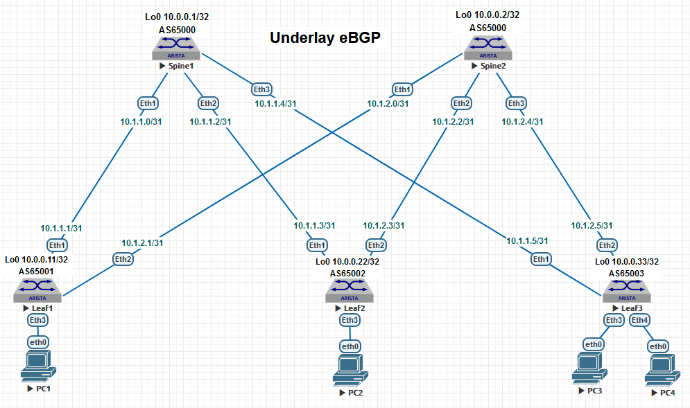

## Домашнее задание №4

### Схема сети и план нумерации для Underlay c eBGP.

### План адресации.

#### IP Loopback адреса и номера AS. 

| Hostname |   Loopback0  |   Loopback1   | ASN   |
| :------: | :-----------:|:-------------:|:------:
|  Spine1  | 10.0.0.1/32  | 10.0.0.101/32 | 65000 |
|  Spine2  | 10.0.0.2/32  | 10.0.0.102/32 | 65000 |
|  Leaf1   | 10.0.0.11/32 | 10.0.0.111/32 | 65001 |
|  Leaf2   | 10.0.0.22/32 | 10.0.0.122/32 | 65002 |
|  Leaf3   | 10.0.0.33/32 | 10.0.0.133/32 | 65003 |

#### P2P подсети.

| Hostname |    Leaf1    |     Leaf2   |     Leaf3   |
| :------: | :----------:|:-----------:|:-----------:|
|  Spine1  | 10.1.1.0/31 | 10.1.1.2/31 | 10.1.1.4/31 |
|  Spine2  | 10.1.2.0/31 | 10.1.2.2/31 | 10.1.2.4/31 |

  
### План развёртывания протокола eBGP для Underlay в домене на всех коммутаторах.
 
#### Меняем режим работы коммутатора с ribd на multi-agent для полного функционала протокола BGP.
 
    service routing protocols model multi-agent 

#### Запускаем процесс eBGP и назначаем Id коммутатору.
 
    router bgp 65000 
        router-id 10.0.0.1 

 
#### Ставим таймеры Keepalive и Hold на минимальные значения 1 и 3 сек. 
 
    router bgp 65000
        timers bgp 1 3 
 
#### Устанавливаем административную дистанцию для маршрутов eBGP 20, а для iBGP маршрутов и локальных подсетей 200. 

    router bgp 65000 
        distance bgp 20 200 200 

    
#### Определяем возможность ECMP для IPv4 префиксов на аплинках у Leaf и на даунлинках у Spine коммутаторов.

    router bgp 65000 
        maximum-paths 8 ecmp 64
 
#### Подключаем соседей.

    router bgp 65000
        neighbor 10.1.1.1 remote-as 65001
        neighbor 10.1.1.3 remote-as 65002
        neighbor 10.1.1.5 remote-as 65003 

#### Таймер MRAI протокола eBGP для немедленного анонса изменений в сторону соседей устанавливаем на 0.  

    router bgp 65000 
        neighbor 10.1.1.1 out-delay 0
        neighbor 10.1.1.3 out-delay 0
        neighbor 10.1.1.5 out-delay 0 

#### Активируем протокол BFD для соседей и на Core интерфейсах. 

    router bgp 65000 
        neighbor 10.1.1.1 bfd 
        neighbor 10.1.1.3 bfd
        neighbor 10.1.1.5 bfd

    interface Ethernet1-3
        bfd interval 100 min-rx 100 multiplier 3 

#### Определяем аутентификацию для соседей. 
 
    router bgp 65000 
        neighbor 10.1.1.1 password 7 B7rhB/vPbn0K7ECNtz1K5w==
        neighbor 10.1.1.3 password 7 6ZlbNVefGOoRTw2KYF4N2A==
        neighbor 10.1.1.5 password 7 zWKcHc58qGjgbjmUvjsL3A==

#### Активируем соседей для маршрутизации IPv4 префиксов.

    router bgp 65000 
        address-family ipv4
            neighbor 10.1.1.1 activate
            neighbor 10.1.1.3 activate
            neighbor 10.1.1.5 activate

#### Делаем редистрибуцию локальных подсетей Loopback интерфейсов.

    router bgp 65000
        address-family ipv4
            network 10.0.0.1/32

Или через route-map 

    ip prefix-list connected-to-bgp
    seq 10 permit 10.0.0.0/24 ge 32
    !
    route-map REDIS_CONN permit 10
    match ip address prefix-list connected-to-bgp
    set origin igp
    !

    router bgp 65000
        address-family ipv4
            redistribute connected route-map REDIS_CONN

### Итоговая конфигурация. 

    Spine1#show run | s bgp

    router bgp 65000
        router-id 10.0.0.1
        no bgp default ipv4-unicast
        timers bgp 1 3
        distance bgp 20 200 200
        maximum-paths 8 ecmp 64
        neighbor 10.1.1.1 remote-as 65001
        neighbor 10.1.1.1 out-delay 0
        neighbor 10.1.1.1 bfd
        neighbor 10.1.1.1 password 7 B7rhB/vPbn0K7ECNtz1K5w==
        neighbor 10.1.1.3 remote-as 65002
        neighbor 10.1.1.3 out-delay 0
        neighbor 10.1.1.3 bfd
        neighbor 10.1.1.3 password 7 6ZlbNVefGOoRTw2KYF4N2A==
        neighbor 10.1.1.5 remote-as 65003
        neighbor 10.1.1.5 out-delay 0
        neighbor 10.1.1.5 bfd
        neighbor 10.1.1.5 password 7 zWKcHc58qGjgbjmUvjsL3A==
        !
        address-family ipv4
            neighbor 10.1.1.1 activate
            neighbor 10.1.1.3 activate
            neighbor 10.1.1.5 activate
            network 10.0.0.1/32

+++++++++++++++++++++++++++++++++++++++++  

    Leaf1#show run | s bgp
        ip prefix-list connected-to-bgp
        seq 10 permit 10.0.0.0/24 ge 32

    route-map REDIS_CONN permit 10
        match ip address prefix-list connected-to-bgp

    router bgp 65001
        router-id 10.0.0.11
        no bgp default ipv4-unicast
        timers bgp 1 3
        distance bgp 20 200 200
        maximum-paths 4 ecmp 64
        neighbor spines peer group
        neighbor spines remote-as 65000
        neighbor spines out-delay 0
        neighbor spines bfd
        neighbor spines maximum-routes 10000 warning-only
        neighbor 10.1.1.0 peer group spines
        neighbor 10.1.1.0 password 7 B7rhB/vPbn0K7ECNtz1K5w==
        neighbor 10.1.2.0 peer group spines
        neighbor 10.1.2.0 password 7 qJkVzQI8BJZIFaQJU7/LYQ==
        !
        address-family ipv4
            neighbor spines activate
            redistribute connected route-map REDIS_CONN
            
###  Проверочная часть. 

#### Проверка работы протокола BFD. 

На примере показан пример проверки на одном коммутаторе. 

    Spine2#show bfd peers 
    VRF name: default 
    -----------------
    DstAddr       MyDisc    YourDisc  Interface/Transport    Type           LastUp  
    --------- ----------- ----------- -------------------- ------- ----------------
    10.1.2.1  2255156730  3039257150        Ethernet1(18)  normal   05/30/24 20:04 
    10.1.2.3  2537779188  4281995752        Ethernet2(19)  normal   05/30/24 20:04 
    10.1.2.5   161062417   787922893        Ethernet3(20)  normal   05/30/24 20:04 
 
    LastDown            LastDiag    State 
    -------------- ------------------- ----- 
         NA       No Diagnostic       Up 
         NA       No Diagnostic       Up 
         NA       No Diagnostic       Up 
 
#### Проверка соседства IS-IS узлов в домене. 

    Spine2#show isis neighbors  
    
    Instance  VRF      System Id        Type Interface          SNPA              State Hold time   Circuit Id           
    netcom    default  Leaf1            L2   Ethernet1          P2P               UP    28          10                  
    netcom    default  Leaf2            L2   Ethernet2          P2P               UP    29          10                   
    netcom    default  Leaf3            L2   Ethernet3          P2P               UP    30          10                   

#### Проверка таблицы маршрутизации, ECMP и IP связности на примере 3-его Leaf коммутатора. 

    Leaf3#show ip route isis 

    VRF: default
    Codes: C - connected, S - static, K - kernel, 
    ----------------------------------------------------------- 
        I L2 - IS-IS level 2, O3 - OSPFv3, A B - BGP Aggregate, 
    ----------------------------------------------------------- 
    I L2     10.0.0.1/32 [115/20] via 10.1.1.4, Ethernet1 
    I L2     10.0.0.2/32 [115/20] via 10.1.2.4, Ethernet2 
    I L2     10.0.0.11/32 [115/30] via 10.1.1.4, Ethernet1 
                                   via 10.1.2.4, Ethernet2 
    I L2     10.0.0.22/32 [115/30] via 10.1.1.4, Ethernet1 
                                   via 10.1.2.4, Ethernet2 
    I L2     10.0.0.101/32 [115/20] via 10.1.1.4, Ethernet1 
    I L2     10.0.0.102/32 [115/20] via 10.1.2.4, Ethernet2 
    I L2     10.0.0.111/32 [115/30] via 10.1.1.4, Ethernet1 
                                    via 10.1.2.4, Ethernet2 
    I L2     10.0.0.122/32 [115/30] via 10.1.1.4, Ethernet1 
                                    via 10.1.2.4, Ethernet2 
    I L2     10.1.1.0/31 [115/20] via 10.1.1.4, Ethernet1 
    I L2     10.1.1.2/31 [115/20] via 10.1.1.4, Ethernet1 
    I L2     10.1.2.0/31 [115/20] via 10.1.2.4, Ethernet2 
    I L2     10.1.2.2/31 [115/20] via 10.1.2.4, Ethernet2 

    Leaf3#ping 10.0.0.11 source 10.0.0.33
    PING 10.0.0.11 (10.0.0.11) from 10.0.0.33 : 72(100) bytes of data.
    80 bytes from 10.0.0.11: icmp_seq=1 ttl=63 time=9.81 ms
    80 bytes from 10.0.0.11: icmp_seq=2 ttl=63 time=6.23 ms
    80 bytes from 10.0.0.11: icmp_seq=3 ttl=63 time=6.24 ms
    80 bytes from 10.0.0.11: icmp_seq=4 ttl=63 time=6.33 ms
    80 bytes from 10.0.0.11: icmp_seq=5 ttl=63 time=7.70 ms

    --- 10.0.0.11 ping statistics ---
    5 packets transmitted, 5 received, 0% packet loss, time 37ms
    rtt min/avg/max/mdev = 6.231/7.264/9.810/1.390 ms, ipg/ewma 9.489/8.525 ms
    Leaf3# 
 
