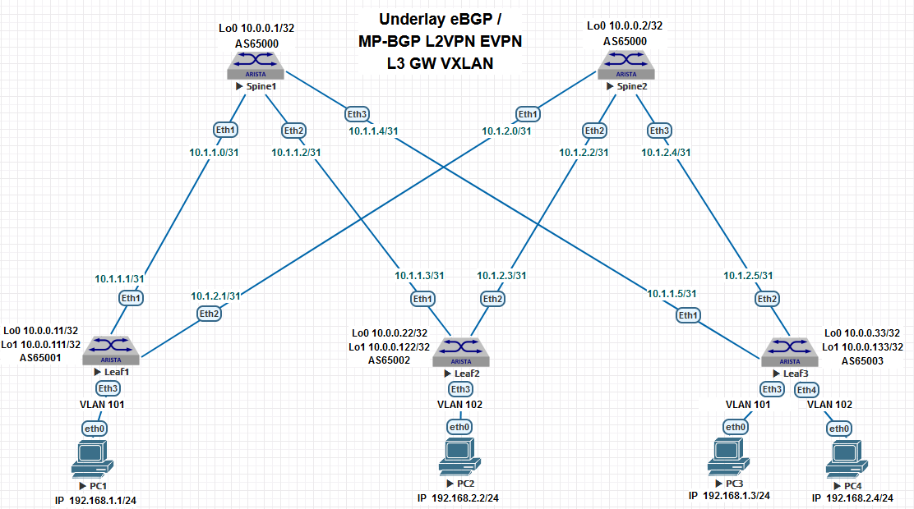

## Домашнее задание №6

### 1. Схема сети и план нумерации для Underlay eBGP, MP-BGP L2VPN EVPN, L2 и L3-Gateway Overlay VXLAN.

### 2. План адресации.

#### 2.1 IP Loopback адреса и номера AS. 

| Hostname |   Loopback0  |   Loopback1   | ASN   |
| :------: | :-----------:|:-------------:|:------:
|  Spine1  | 10.0.0.1/32  | 10.0.0.101/32 | 65000 |
|  Spine2  | 10.0.0.2/32  | 10.0.0.102/32 | 65000 |
|  Leaf1   | 10.0.0.11/32 | 10.0.0.111/32 | 65001 |
|  Leaf2   | 10.0.0.22/32 | 10.0.0.122/32 | 65002 |
|  Leaf3   | 10.0.0.33/32 | 10.0.0.133/32 | 65003 |

#### 2.2 P2P подсети.

| Hostname |    Leaf1    |     Leaf2   |     Leaf3   |
| :------: | :----------:|:-----------:|:-----------:|
|  Spine1  | 10.1.1.0/31 | 10.1.1.2/31 | 10.1.1.4/31 |
|  Spine2  | 10.1.2.0/31 | 10.1.2.2/31 | 10.1.2.4/31 |

  
### 3. План развёртывания протокола MP-eBGP на Spine на коммутаторах.

### Примечание: Underlay eBGP был развёрнут в ДЗ №4.
 
#### 3.1 Создаём отдельную bgp peer группу для Leaf коммутаторов с целью распространения в Pod MP-BGP ADDRESS-FAMILY L2VPN AFI 25 EVPN SAFI 70.
 
    router bgp 65000
        neighbor evpn-leaves peer group

#### 3.2 MP-eBGP сессии будут строятся на Loopback интерфейсах. Для Exterior MP-BPG указываем дополнительно параметр multihop равное 3, так как TTL в eBGP по умолчанию равен 1. 
 
        neighbor evpn-leaves update-source Loopback0
        neighbor evpn-leaves ebgp-multihop 3

#### 3.3 По умолчанию eBGP меняет параметр и адрес next-hop при получении анонсов, в нашем случае источники и конечные получатели апдейтов это только Leaf коммутаторы, поэтому оставляем адреса источников mp-bgp апдейтов неизменными. 
 
        neighbor evpn-leaves next-hop-unchanged 
 
#### 3.4  Включаем функцию анонсирования в MP-BGP расширенных bgp комьюнити для распространения route-distinguisher и route-target атрибутов. 

        neighbor evpn-leaves send-community extended

    
#### 3.5 Указываем какие соседи-лифы у нас будут входить в bgp peer группу evpn-leaves.

        neighbor 10.0.0.11 peer group evpn-leaves
        neighbor 10.0.0.11 remote-as 65001
        neighbor 10.0.0.22 peer group evpn-leaves
        neighbor 10.0.0.22 remote-as 65002
        neighbor 10.0.0.33 peer group evpn-leaves
        neighbor 10.0.0.33 remote-as 65003
 
#### 3.6 Активируем нашу peer группу под address-family evpn протокола MP-BGP. 

    router bgp 65000
        address-family evpn
            neighbor evpn-leaves activate

### 4. План развёртывания протокола MP-eBGP на Leaf на коммутаторах

#### 4.1 Создаём отдельную bgp peer группу для Spine коммутаторов с целью распространения в Pod MP-BGP AF L2VPN AFI 25 EVPN SAFI 70, оставляя по умолчанию поведение атрибута next-hop в eBGP.

    router bgp 65001 
        neighbor evpn-spines peer group
        neighbor evpn-spines remote-as 65000
        neighbor evpn-spines update-source Loopback0
        neighbor evpn-spines ebgp-multihop 3
        neighbor evpn-spines send-community extended

        neighbor 10.0.0.1 peer group evpn-spines
        neighbor 10.0.0.2 peer group evpn-spines

        address-family evpn
            neighbor evpn-spines activate

### 5. Подключаем хосты PC1 и PC3 к соотвествующим Leaf1 и Leaf3 коммутаторам.  

#### 5.1 Устанавливаем режим работы интерфейсов в сторону хостов access и назначаем на них vlan 101.
 
    Leaf1#show run interfaces Ethernet 3
    interface Ethernet3
        switchport access vlan 101

    Leaf3#show run interfaces Ethernet 3
    interface Ethernet3
        switchport access vlan 101

### 6. Назначаем IP адреса хостам.

    vPC1> show ip 
    NAME        : PC1
    IP/MASK     : 192.168.1.1/24
    MAC         : 00:50:79:66:68:06
    MTU         : 1500

    vPC3> show ip 
    NAME        : PC3
    IP/MASK     : 192.168.1.3/24
    MAC         : 00:50:79:66:68:08
    MTU         : 1500

### 7. Настраиваем Network Virtual Edge устройство на крайних Leaf коммутаторах.

#### 7.1 Создаём туннелированный интерфейс Vxlan, в котором используем интерфейс Loopback1 в качестве source.

    interface Vxlan1
        vxlan source-interface Loopback1
        vxlan udp-port 4789

#### 7.2 Делаем привязку VLAN 101 к VXLAN VNI.
    
    interface Vxlan1
        vxlan vlan 101 vni 10101

#### 7.3 Создаём MAC-VRF.

    Leaf1#
    router bgp 65001
        vlan 101
        rd 65001:10101
        route-target both 101:10101
        redistribute learned
    
    Leaf3#
    router bgp 65003
        vlan 101
        rd 65003:10101
        route-target both 101:10101
        redistribute learned

### 8. Итоговые конфигурации Spine и Leaf коммутаторов. 

    Spine1#show run 
    !
    service routing protocols model multi-agent
    !
    hostname Spine1
    !
    spanning-tree mode mstp
    !
    interface Ethernet1
        description to-Leaf1
        mtu 9000
        no switchport
        ip address 10.1.1.0/31
        bfd interval 100 min-rx 100 multiplier 3
    !
    interface Ethernet2
        description to-Leaf2
        mtu 9000
        no switchport
        ip address 10.1.1.2/31
        bfd interval 100 min-rx 100 multiplier 3
    !
    interface Ethernet3
        description to-Leaf3
        mtu 9000
        no switchport
        ip address 10.1.1.4/31
        bfd interval 100 min-rx 100 multiplier 3
    !
    interface Loopback0
        ip address 10.0.0.1/32
    !
    ip routing
    !
    router bgp 65000
        router-id 10.0.0.1
        no bgp default ipv4-unicast
        timers bgp 1 3
        distance bgp 20 200 200
        maximum-paths 8 ecmp 64
        neighbor evpn-leaves peer group
        neighbor evpn-leaves next-hop-unchanged
        neighbor evpn-leaves update-source Loopback0
        neighbor evpn-leaves ebgp-multihop 3
        neighbor evpn-leaves send-community extended
        neighbor 10.0.0.11 peer group evpn-leaves
        neighbor 10.0.0.11 remote-as 65001
        neighbor 10.0.0.22 peer group evpn-leaves
        neighbor 10.0.0.22 remote-as 65002
        neighbor 10.0.0.33 peer group evpn-leaves
        neighbor 10.0.0.33 remote-as 65003
        neighbor 10.1.1.1 remote-as 65001
        neighbor 10.1.1.1 out-delay 0
        neighbor 10.1.1.1 bfd
        neighbor 10.1.1.1 password 7 B7rhB/vPbn0K7ECNtz1K5w==
        neighbor 10.1.1.3 remote-as 65002
        neighbor 10.1.1.3 out-delay 0
        neighbor 10.1.1.3 bfd
        neighbor 10.1.1.3 password 7 6ZlbNVefGOoRTw2KYF4N2A==
        neighbor 10.1.1.5 remote-as 65003
        neighbor 10.1.1.5 out-delay 0
        neighbor 10.1.1.5 bfd
        neighbor 10.1.1.5 password 7 zWKcHc58qGjgbjmUvjsL3A==
    !
        address-family evpn
            neighbor evpn-leaves activate
    !
        address-family ipv4
            neighbor 10.1.1.1 activate
            neighbor 10.1.1.3 activate
            neighbor 10.1.1.5 activate
            network 10.0.0.1/32
    !
    end

+++++++++++++++++++++++++++++++++++++++++  

    Leaf1#show run 
    !
    service routing protocols model multi-agent
    !
    hostname Leaf1
    !
    spanning-tree mode mstp
    !
    vlan 101
    !
    interface Ethernet1
        description to-Spine1
        mtu 9000
        no switchport
        ip address 10.1.1.1/31
        bfd interval 100 min-rx 100 multiplier 3
    !
    interface Ethernet2
        description to-Spine2
        mtu 9000
        no switchport
        ip address 10.1.2.1/31
        bfd interval 100 min-rx 100 multiplier 3
    !
    interface Ethernet3
        switchport access vlan 101
    !
    interface Loopback0
        ip address 10.0.0.11/32
    !
    interface Loopback1
        ip address 10.0.0.111/32
    !
    interface Vxlan1
        vxlan source-interface Loopback1
        vxlan udp-port 4789
        vxlan vlan 101 vni 10101
    !
    ip routing
    !
    ip prefix-list connected-to-bgp
        seq 10 permit 10.0.0.0/24 ge 32
    !
    route-map REDIS_CONN permit 10
        match ip address prefix-list connected-to-bgp
        set origin igp
    !
    router bgp 65001
        router-id 10.0.0.11
        no bgp default ipv4-unicast
        timers bgp 1 3
        distance bgp 20 200 200
        maximum-paths 4 ecmp 64
        neighbor evpn-spines peer group
        neighbor evpn-spines remote-as 65000
        neighbor evpn-spines update-source Loopback0
        neighbor evpn-spines ebgp-multihop 3
        neighbor evpn-spines send-community extended
        neighbor spines peer group
        neighbor spines remote-as 65000
        neighbor spines out-delay 0
        neighbor spines bfd
        neighbor spines maximum-routes 10000 warning-only
        neighbor 10.0.0.1 peer group evpn-spines
        neighbor 10.0.0.2 peer group evpn-spines
        neighbor 10.1.1.0 peer group spines
        neighbor 10.1.1.0 password 7 B7rhB/vPbn0K7ECNtz1K5w==
        neighbor 10.1.2.0 peer group spines
        neighbor 10.1.2.0 password 7 qJkVzQI8BJZIFaQJU7/LYQ==
        !
        vlan 101
            rd 65001:10101
            route-target both 101:10101
            redistribute learned
    !
        address-family evpn
            neighbor evpn-spines activate
    !
        address-family ipv4
            neighbor spines activate
            redistribute connected route-map REDIS_CONN
    !
    end

###  9. Проверочная часть. 

#### 9.1 Проверяем что MP-BGP сессии у нас поднялись. 

На примере показан пример проверки не на всех коммутаторах. 

    Spine2#show bgp evpn summary
    BGP summary information for VRF default
    Router identifier 10.0.0.2, local AS number 65000
    Neighbor Status Codes: m - Under maintenance
        Neighbor  V AS           MsgRcvd   MsgSent  InQ OutQ  Up/Down State   PfxRcd PfxAcc
        10.0.0.11 4 65001          80684     80623    0    0 19:00:28 Estab   1      1
        10.0.0.22 4 65002          81150     81150    0    0 18:04:52 Estab   0      0
        10.0.0.33 4 65003          81185     81156    0    0 18:01:40 Estab   1      1

    Leaf3#show bgp evpn summary 
    BGP summary information for VRF default
    Router identifier 10.0.0.33, local AS number 65003
    Neighbor Status Codes: m - Under maintenance
        Neighbor V AS           MsgRcvd   MsgSent  InQ OutQ  Up/Down State   PfxRcd PfxAcc
        10.0.0.1 4 65000          76094     76077    0    0 18:00:42 Estab   1      1
        10.0.0.2 4 65000          76122     76149    0    0 18:00:42 Estab   1      1
 
#### 9.2 Проверка статуса VTEP устройства - интерфейса VXLAN, он должен быть в состоянии UP & UP.

    Leaf1#show interfaces Vxlan1
    Vxlan1 is up, line protocol is up (connected)
    Hardware is Vxlan
    Source interface is Loopback1 and is active with 10.0.0.111
    Listening on UDP port 4789
    Replication/Flood Mode is headend with Flood List Source: EVPN
    Remote MAC learning via EVPN
    VNI mapping to VLANs
    Static VLAN to VNI mapping is 
    [101, 10101]     
    Note: All Dynamic VLANs used by VCS are internal VLANs.
        Use 'show vxlan vni' for details.
    Static VRF to VNI mapping is not configured
    Headend replication flood vtep list is:
        101 10.0.0.133     
    Shared Router MAC is 0000.0000.0000

#### 9.3 Можем проверить статус удалённого VTEP. 

    Leaf1#show vxlan vtep
    Remote VTEPS for Vxlan1:

    VTEP             Tunnel Type(s)
    ---------------- --------------
    10.0.0.133       unicast, flood

#### 9.3 Можем удостовериться в наличии полученных и локальных EVPN RT Type-2 префиксов в MP-BGP и работы ECMP.

    Leaf1#show bgp evpn route-type mac-ip
    BGP routing table information for VRF default
    Router identifier 10.0.0.11, local AS number 65001
    Route status codes: * - valid, > - active, S - Stale, E - ECMP head, e - ECMP
                    c - Contributing to ECMP, % - Pending BGP convergence
    Origin codes: i - IGP, e - EGP, ? - incomplete
    AS Path Attributes: Or-ID - Originator ID, C-LST - Cluster List, LL Nexthop - Link Local Nexthop

        Network                Next Hop              Metric  LocPref Weight  Path
    * >      RD: 65001:10101 mac-ip 0050.7966.6806
                                 -                     -       -       0       i
    * >Ec    RD: 65003:10101 mac-ip 0050.7966.6808
                                10.0.0.133            -       100     0       65000 65003 i
    *  ec    RD: 65003:10101 mac-ip 0050.7966.6808
                                10.0.0.133            -       100     0       65000 65003 i

#### 9.5 Проверяем наличие MAC адресов, полученных через VTEP и локально.

    Leaf1#show vxlan address-table
          Vxlan Mac Address Table
    ----------------------------------------------------------------------

    VLAN  Mac Address     Type      Prt  VTEP             Moves   Last Move
    ----  -----------     ----      ---  ----             -----   ---------
    101  0050.7966.6808  EVPN      Vx1  10.0.0.133       1       0:03:43 ago
    Total Remote Mac Addresses for this criterion: 1

    Total number of remote VTEPS:  1

    Leaf1#show mac address-table unicast
          Mac Address Table
    ------------------------------------------------------------------

    Vlan    Mac Address       Type        Ports      Moves   Last Move
    ----    -----------       ----        -----      -----   ---------
    101    0050.7966.6806    DYNAMIC     Et3        1       0:00:05 ago
    101    0050.7966.6808    DYNAMIC     Vx1        1       0:00:05 ago
    Total Mac Addresses for this criterion: 2

#### 9.6 И наконец проверяем IP связность хостов PC1 и PC3.

    vPC3> ping 192.168.1.1

    84 bytes from 192.168.1.1 icmp_seq=1 ttl=64 time=20.430 ms
    84 bytes from 192.168.1.1 icmp_seq=2 ttl=64 time=24.945 ms
    84 bytes from 192.168.1.1 icmp_seq=3 ttl=64 time=19.526 ms
    84 bytes from 192.168.1.1 icmp_seq=4 ttl=64 time=22.555 ms
    84 bytes from 192.168.1.1 icmp_seq=5 ttl=64 time=23.079 ms

    vPC1> ping 192.168.1.3

    84 bytes from 192.168.1.3 icmp_seq=1 ttl=64 time=18.616 ms
    84 bytes from 192.168.1.3 icmp_seq=2 ttl=64 time=20.197 ms
    84 bytes from 192.168.1.3 icmp_seq=3 ttl=64 time=20.896 ms
    84 bytes from 192.168.1.3 icmp_seq=4 ttl=64 time=20.779 ms
    84 bytes from 192.168.1.3 icmp_seq=5 ttl=64 time=19.243 ms

