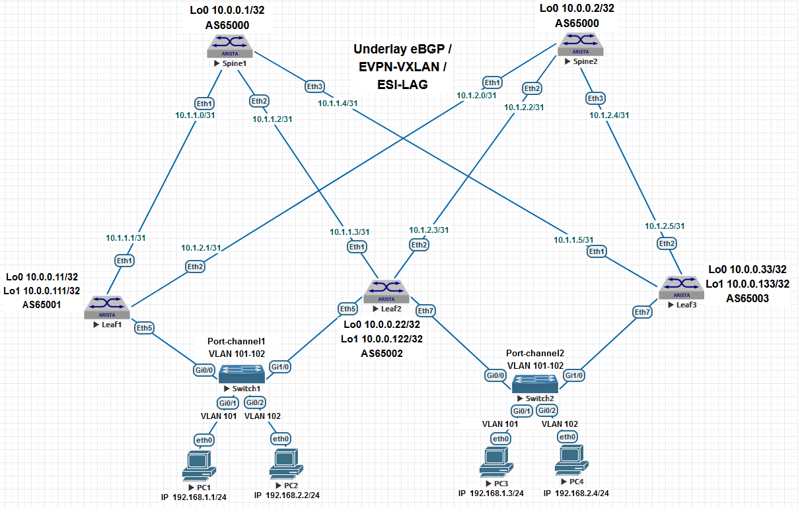

## Домашнее задание №7

### 1. Схема сети и план нумерации для Underlay eBGP, MP-BGP L2VPN EVPN, L2/L3-GW Overlay VXLAN, ESI-LAG.

### 2. План адресации.

#### 2.1 IP Loopback адреса и номера AS. 

| Hostname |   Loopback0  |   Loopback1   | ASN   |
| :------: | :-----------:|:-------------:|:------:
|  Spine1  | 10.0.0.1/32  | 10.0.0.101/32 | 65000 |
|  Spine2  | 10.0.0.2/32  | 10.0.0.102/32 | 65000 |
|  Leaf1   | 10.0.0.11/32 | 10.0.0.111/32 | 65001 |
|  Leaf2   | 10.0.0.22/32 | 10.0.0.122/32 | 65002 |
|  Leaf3   | 10.0.0.33/32 | 10.0.0.133/32 | 65003 |

#### 2.2 P2P подсети.

| Hostname |    Leaf1    |     Leaf2   |     Leaf3   |
| :------: | :----------:|:-----------:|:-----------:|
|  Spine1  | 10.1.1.0/31 | 10.1.1.2/31 | 10.1.1.4/31 |
|  Spine2  | 10.1.2.0/31 | 10.1.2.2/31 | 10.1.2.4/31 |

#### 2.3 Адреса хостов.

|  Hostname |        PC1        |        PC2        |        PC3        |        PC4        |
| :--------:| :----------------:|:-----------------:|:-----------------:|:-----------------:|
|  IP       |  192.168.1.1/24   |  192.168.2.2/24   |  192.168.1.3/24   |  192.168.2.4/24   |
|  Gateway  |  192.168.1.254/24 |  192.168.2.254/24 | 192.168.1.254/24  |  192.168.2.254/24 |
|   VLAN    |        101        |         102       |         101       |        102        |
|   MAC     | 00:50:79:66:68:06 | 00:50:79:66:68:07 | 00:50:79:66:68:08 | 00:50:79:66:68:09 |

### 3. План развёртывания ESI-LAG на Leaf на коммутаторах.

### Примечание: Underlay eBGP был развёрнут в ДЗ №4; L2 Overlay VXLAN в ДЗ №5, L3 VTEP в ДЗ №6. 
 
#### 3.1 Создаём и убеждаемся в наличии vlan 101 и 102 на коммутаторах.
 
    vlan 101-102

#### 3.2 Создаём IRB интерфейсы VTEP IP. 
 
    interface Vlan101
        description IRB VLAN101
        ip address virtual 192.168.1.254/24
    !
    interface Vlan102
        description IRB VLAN102
        ip address virtual 192.168.2.254/24

#### 3.3 Создаём одинаковый на всех коммутаторах VARP MAC. 
 
    ip virtual-router mac-address 00:1c:73:00:00:aa
 
#### 3.4 Привязываем vlan к vxlan. 

    interface Vxlan1
        vxlan source-interface Loopback1
        vxlan udp-port 4789
        vxlan vlan 101 vni 10101
        vxlan vlan 102 vni 10102

    
#### 3.5 Создаём MAC-VRF для каждого vlan.

    router bgp 65001
        vlan 101
            rd 65001:10101
            route-target both 101:10101
            redistribute learned
    !
        vlan 102
            rd 65001:10102
            route-target both 102:10102
 
Если vlan не назначен на портах, то можно не указывать redistribute learned.

### 5. Подключаем хосты PC2 и PC4 к соотвествующим Leaf2 и Leaf3 коммутаторам.  

#### 5.1 Устанавливаем режим работы интерфейсов в сторону хостов access и назначаем на них vlan 102.
 
    Leaf2#show run interfaces Ethernet 3
    interface Ethernet3
        description to-Host2
        switchport access vlan 102

    Leaf3#show run interfaces Ethernet 4
    interface Ethernet4
        description to-Host4
        switchport access vlan 102

### 6. Назначаем IP адреса и адреса Gateway хостам.

    vPC2> show ip 
    NAME        : PC2
    IP/MASK     : 192.168.2.2/24
    GATEWAY     : 192.168.2.254
    MAC         : 00:50:79:66:68:07
    MTU         : 1500

    vPC4> show ip 
    NAME        : PC4
    IP/MASK     : 192.168.2.4/24
    GATEWAY     : 192.168.2.254
    MAC         : 00:50:79:66:68:09
    MTU         : 1500

### 7. Итоговые конфигурации Leaf коммутаторов. 

    Leaf2#show run
    !
    service routing protocols model multi-agent
    !
    hostname Leaf2
    !
    spanning-tree mode mstp
    !
    vlan 101-102
    !
    interface Ethernet1
        description to-Spine1
        mtu 9000
        no switchport
        ip address 10.1.1.3/31
        bfd interval 100 min-rx 100 multiplier 3
    !
    interface Ethernet2
        description to-Spine2
        mtu 9000
        no switchport
        ip address 10.1.2.3/31
        bfd interval 100 min-rx 100 multiplier 3
    !
    interface Ethernet3
        description to-Host2
        switchport access vlan 102
    !
    interface Loopback0
        ip address 10.0.0.22/32
    !
    interface Loopback1
        ip address 10.0.0.122/32
    !
    interface Management1
        shutdown
    !
    interface Vlan101
        description IRB VLAN102
        ip address virtual 192.168.1.254/24
    !
    interface Vlan102
        description IRB VLAN102
        ip address virtual 192.168.2.254/24
    !
    interface Vxlan1
        vxlan source-interface Loopback1
        vxlan udp-port 4789
        vxlan vlan 101 vni 10101
        vxlan vlan 102 vni 10102
    !
    ip virtual-router mac-address 00:1c:73:00:00:aa
    !
    ip routing
    !
    ip prefix-list connected-to-bgp
        seq 10 permit 10.0.0.0/24 ge 32
    !
    route-map REDIS_CONN permit 10
        match ip address prefix-list connected-to-bgp
        set origin igp
    !
    router bgp 65002
        router-id 10.0.0.22
        no bgp default ipv4-unicast
        timers bgp 1 3
        distance bgp 20 200 200
        maximum-paths 4 ecmp 64
        neighbor evpn peer group
        neighbor evpn remote-as 65000
        neighbor evpn update-source Loopback0
        neighbor evpn ebgp-multihop 3
        neighbor evpn send-community extended
        neighbor evpn-spines peer group
        neighbor evpn-spines remote-as 65000
        neighbor evpn-spines update-source Loopback0
        neighbor evpn-spines ebgp-multihop 3
        neighbor evpn-spines send-community extended
        neighbor spines peer group
        neighbor spines remote-as 65000
        neighbor spines out-delay 0
        neighbor spines bfd
        neighbor spines maximum-routes 10000 warning-only
        neighbor 10.0.0.1 peer group evpn-spines
        neighbor 10.0.0.2 peer group evpn-spines
        neighbor 10.1.1.2 peer group spines
        neighbor 10.1.1.2 password 7 6ZlbNVefGOoRTw2KYF4N2A==
        neighbor 10.1.2.2 peer group spines
        neighbor 10.1.2.2 password 7 k/sLtX4he3Tjv/dsbbHquA==
    !
    vlan 101
        rd 65002:10101
        route-target both 101:10101
    !
    vlan 102
        rd 65002:10102
        route-target both 102:10102
        redistribute learned
    !
    address-family evpn
        neighbor evpn-spines activate
    !
    address-family ipv4
        neighbor spines activate
        redistribute connected route-map REDIS_CONN
    !
    end

+++++++++++++++++++++++++++++++++++++++++  

    Leaf3#show run
    !
    service routing protocols model multi-agent
    !
    hostname Leaf3
    !
    spanning-tree mode mstp
    !
    vlan 101-102
    !
    interface Ethernet1
        description to-Spine1
        mtu 9000
        no switchport
        ip address 10.1.1.5/31
        bfd interval 100 min-rx 100 multiplier 3
    !
    interface Ethernet2
        description to-Spine2
        mtu 9000
        no switchport
        ip address 10.1.2.5/31
        bfd interval 100 min-rx 100 multiplier 3
    !
    interface Ethernet3
        description to-Host3
        switchport access vlan 101
    !
    interface Ethernet4
        description to-Host4
        switchport access vlan 102
    !
    interface Loopback0
        ip address 10.0.0.33/32
    !
    interface Loopback1
        ip address 10.0.0.133/32
    !
    interface Management1
        shutdown
    !
    interface Vlan101
        description IRB VLAN101
        ip address virtual 192.168.1.254/24
    !
    interface Vlan102
        description IRB VLAN102
        ip address virtual 192.168.2.254/24
    !
    interface Vxlan1
        vxlan source-interface Loopback1
        vxlan udp-port 4789
        vxlan vlan 101 vni 10101
        vxlan vlan 102 vni 10102
    !
    ip virtual-router mac-address 00:1c:73:00:00:aa
    !
    ip routing
    !
    ip prefix-list connected-to-bgp
        seq 10 permit 10.0.0.0/24 ge 32
    !
    route-map REDIS_CONN permit 10
        match ip address prefix-list connected-to-bgp
        set origin igp
    !
    router bgp 65003
        router-id 10.0.0.33
        no bgp default ipv4-unicast
        timers bgp 1 3
        distance bgp 20 200 200
        maximum-paths 4 ecmp 64
        neighbor evpn-spines peer group
        neighbor evpn-spines remote-as 65000
        neighbor evpn-spines update-source Loopback0
        neighbor evpn-spines ebgp-multihop 3
        neighbor evpn-spines send-community extended
        neighbor spines peer group
        neighbor spines remote-as 65000
        neighbor spines out-delay 0
        neighbor spines bfd
        neighbor spines maximum-routes 10000 warning-only
        neighbor 10.0.0.1 peer group evpn-spines
        neighbor 10.0.0.2 peer group evpn-spines
        neighbor 10.1.1.4 peer group spines
        neighbor 10.1.1.4 password 7 zWKcHc58qGjgbjmUvjsL3A==
        neighbor 10.1.2.4 peer group spines
        neighbor 10.1.2.4 password 7 qEWAlLTC4nfcCtaj0TBNoQ==
    !
    vlan 101
        rd 65003:10101
        route-target both 101:10101
        redistribute learned
    !
    vlan 102
        rd 65003:10102
        route-target both 102:10102
        redistribute learned
    !
    address-family evpn
        neighbor evpn-spines activate
    !
    address-family ipv4
        neighbor spines activate
        redistribute connected route-map REDIS_CONN
    !
    end

###  8. Проверочная часть. 

#### 9.1 Сразу проверяем доступность хостов пингом. 

На примере показан пример проверки с хоста PC1. 

    PC1> ping 192.168.1.3 -c 2
    84 bytes from 192.168.1.3 icmp_seq=1 ttl=64 time=51.896 ms
    84 bytes from 192.168.1.3 icmp_seq=2 ttl=64 time=19.726 ms

    PC1> ping 192.168.2.2 -c 2
    84 bytes from 192.168.2.2 icmp_seq=1 ttl=63 time=141.124 ms
    84 bytes from 192.168.2.2 icmp_seq=2 ttl=63 time=22.423 ms

    PC1> ping 192.168.2.4 -c 2
    84 bytes from 192.168.2.4 icmp_seq=1 ttl=63 time=141.139 ms
    84 bytes from 192.168.2.4 icmp_seq=2 ttl=63 time=26.680 ms
 
#### 9.2 Проверяем наличие MAC адресов, полученных через VTEP и локально.

    Leaf1#show vxlan address-table
          Vxlan Mac Address Table
    ----------------------------------------------------------------------
    VLAN  Mac Address     Type      Prt  VTEP             Moves   Last Move
    ----  -----------     ----      ---  ----             -----   ---------
    101  0050.7966.6808  EVPN      Vx1  10.0.0.133       1       0:02:33 ago
    102  0050.7966.6807  EVPN      Vx1  10.0.0.122       1       0:02:25 ago
    102  0050.7966.6809  EVPN      Vx1  10.0.0.133       1       0:02:18 ago
    Total Remote Mac Addresses for this criterion: 3

    Leaf1#show mac address-table unicast 
          Mac Address Table
    ------------------------------------------------------------------
    Vlan    Mac Address       Type        Ports      Moves   Last Move
    ----    -----------       ----        -----      -----   ---------
    1    001c.7300.00aa    STATIC      Cpu
    101    001c.7300.00aa    STATIC      Cpu
    101    0050.7966.6806    DYNAMIC     Et3        1       0:02:48 ago
    101    0050.7966.6808    DYNAMIC     Vx1        1       0:02:48 ago
    102    001c.7300.00aa    STATIC      Cpu
    102    0050.7966.6807    DYNAMIC     Vx1        1       0:02:39 ago
    102    0050.7966.6809    DYNAMIC     Vx1        1       0:02:33 ago
    Total Mac Addresses for this criterion: 7

#### 9.3 Можем удостовериться в наличии полученных и локальных EVPN RT Type-2 префиксов в MP-BGP и работы ECMP.

    Leaf1#show bgp evpn route-type mac-ip 192.168.1.1
    BGP routing table information for VRF default
    Router identifier 10.0.0.11, local AS number 65001
    Route status codes: * - valid, > - active, S - Stale, E - ECMP head, e - ECMP
                    c - Contributing to ECMP, % - Pending BGP convergence
    Origin codes: i - IGP, e - EGP, ? - incomplete
    AS Path Attributes: Or-ID - Originator ID, C-LST - Cluster List, LL Nexthop - Link Local Nexthop

          Network                Next Hop              Metric  LocPref Weight  Path
    * >      RD: 65001:10101 mac-ip 0050.7966.6806 192.168.1.1
                                 -                     -       -       0       i

    Leaf1#show bgp evpn route-type mac-ip 192.168.1.3
    BGP routing table information for VRF default
    Router identifier 10.0.0.11, local AS number 65001
    Route status codes: * - valid, > - active, S - Stale, E - ECMP head, e - ECMP
                    c - Contributing to ECMP, % - Pending BGP convergence
    Origin codes: i - IGP, e - EGP, ? - incomplete
    AS Path Attributes: Or-ID - Originator ID, C-LST - Cluster List, LL Nexthop - Link Local Nexthop

          Network                Next Hop              Metric  LocPref Weight  Path
    * >Ec    RD: 65003:10101 mac-ip 0050.7966.6808 192.168.1.3
                                 10.0.0.133            -       100     0       65000 65003 i
    *  ec    RD: 65003:10101 mac-ip 0050.7966.6808 192.168.1.3
                                 10.0.0.133            -       100     0       65000 65003 i

    Leaf1#show bgp evpn route-type mac-ip 192.168.2.2
    BGP routing table information for VRF default
    Router identifier 10.0.0.11, local AS number 65001
    Route status codes: * - valid, > - active, S - Stale, E - ECMP head, e - ECMP
                    c - Contributing to ECMP, % - Pending BGP convergence
    Origin codes: i - IGP, e - EGP, ? - incomplete
    AS Path Attributes: Or-ID - Originator ID, C-LST - Cluster List, LL Nexthop - Link Local Nexthop

          Network                Next Hop              Metric  LocPref Weight  Path
    * >Ec    RD: 65002:10102 mac-ip 0050.7966.6807 192.168.2.2
                                 10.0.0.122            -       100     0       65000 65002 i
    *  ec    RD: 65002:10102 mac-ip 0050.7966.6807 192.168.2.2
                                 10.0.0.122            -       100     0       65000 65002 i

    Leaf1#show bgp evpn route-type mac-ip 192.168.2.4
    BGP routing table information for VRF default
    Router identifier 10.0.0.11, local AS number 65001
    Route status codes: * - valid, > - active, S - Stale, E - ECMP head, e - ECMP
                    c - Contributing to ECMP, % - Pending BGP convergence
    Origin codes: i - IGP, e - EGP, ? - incomplete
    AS Path Attributes: Or-ID - Originator ID, C-LST - Cluster List, LL Nexthop - Link Local Nexthop

          Network                Next Hop              Metric  LocPref Weight  Path
    * >Ec    RD: 65003:10102 mac-ip 0050.7966.6809 192.168.2.4
                                 10.0.0.133            -       100     0       65000 65003 i
    *  ec    RD: 65003:10102 mac-ip 0050.7966.6809 192.168.2.4
                                 10.0.0.133            -       100     0       65000 65003 i

