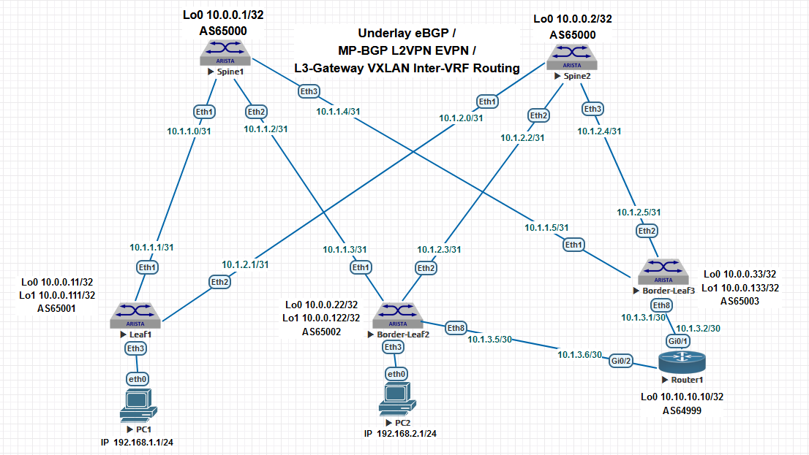

## Домашнее задание №8

### 1. Схема сети и план нумерации для Underlay eBGP, MP-BGP L2VPN EVPN, Overlay VXLAN.

### 2. План адресации.

#### 2.1 IP Loopback адреса и номера AS.

| Hostname |   Loopback0  |   Loopback1   | ASN   |
| :------: | :-----------:|:-------------:|:------:
|  Spine1  | 10.0.0.1/32  | 10.0.0.101/32 | 65000 |
|  Spine2  | 10.0.0.2/32  | 10.0.0.102/32 | 65000 |
|  Leaf1   | 10.0.0.11/32 | 10.0.0.111/32 | 65001 |
|  Leaf2   | 10.0.0.22/32 | 10.0.0.122/32 | 65002 |
|  Leaf3   | 10.0.0.33/32 | 10.0.0.133/32 | 65003 |

#### 2.2 P2P подсети.

| Hostname |    Leaf1    |     Leaf2   |     Leaf3   |
| :------: | :----------:|:-----------:|:-----------:|
|  Spine1  | 10.1.1.0/31 | 10.1.1.2/31 | 10.1.1.4/31 |
|  Spine2  | 10.1.2.0/31 | 10.1.2.2/31 | 10.1.2.4/31 |

| Hostname | Border-Leaf2 | Border-Leaf3 |
| :------: | :-----------:|:------------:|
|  Router1 |  10.1.3.4/30 |  10.1.3.0/30 | 

#### 2.3 Адреса хостов.

|  Hostname |        PC1        |        PC2        |
| :--------:| :----------------:|:-----------------:|
|  IP       |  192.168.1.1/24   |  192.168.2.2/24   |
|  Gateway  |  192.168.1.254/24 |  192.168.2.254/24 |
|   VLAN    |        101        |         102       |
|   MAC     | 00:50:79:66:68:06 | 00:50:79:66:68:07 |

### 3. Подключение внешнего маршрутизатора к Border Leaf коммутаторам.

### Примечание: Underlay eBGP был развёрнут в ДЗ №4; L2 Overlay VXLAN в ДЗ №5, L3 VXLAN Gateway в ДЗ №6. 
 
#### 3.1 Создаём VRF для первого пользователя на Leaf1 и на Border Leaf3.
 
    Leaf1#sh run | s vrf
    
    vrf instance vpn-1

    ip routing vrf vpn-1

    router bgp 65001
        vrf vpn-1
            rd 65001:1
            route-target import evpn 1:1
            route-target export evpn 1:1
            router-id 10.0.0.11

    Border-Leaf3#sh run | s vrf

    vrf instance vpn-1

    ip routing vrf vpn-1

    router bgp 65003
        vrf vpn-1
            rd 65003:1
            route-target import evpn 1:1
            route-target export evpn 1:1
            router-id 10.0.0.33

#### 3.2 Определяем Gateway в VRF для 1ого пользователя на Border Leaf3.

    Border-Leaf3#

    interface Vlan101
        description IRB VLAN101
        vrf vpn-1
        ip address 192.168.1.254/24

#### 3.3 Дополнительно инкасулируем трафик пользователя в VRF в VXLAN. 
 
    Leaf1#

    interface Vxlan1
        vxlan vrf vpn-1 vni 10001
 
    
    Border-Leaf3#

    interface Vxlan1
        vxlan vrf vpn-1 vni 10001

#### 3.4 Создаём L3 связность между Border Leaf3 и внешним маршрутизатором Router1. 

    Border-Leaf3#

    interface Ethernet8
        no switchport

    interface Ethernet8.101
        encapsulation dot1q vlan 101
        vrf vpn-1
        ip address 10.1.3.1/30
    
    
    Router1#   

    interface GigabitEthernet0/1
        no ip address

    interface GigabitEthernet0/1.101
        encapsulation dot1Q 101
        ip address 10.1.3.2 255.255.255.252

#### 3.5 Создаём BGP сессию между Border Leaf3 и внешним маршрутизатором Router1. 

    Border-Leaf3#

    router bgp 65003
        vrf vpn-1
            neighbor 10.1.3.2 remote-as 64999
            neighbor 10.1.3.2 send-community extended
            redistribute connected
            !
            address-family ipv4
                neighbor 10.1.3.2 activate

    Router1#
    
    router bgp 64999
    bgp router-id 10.10.10.10
    bgp log-neighbor-changes
    timers bgp 1 3
    neighbor 10.1.3.1 remote-as 65003
    !
    address-family ipv4
        neighbor 10.1.3.1 activate
        neighbor 10.1.3.1 send-community both

### 4. Создаём аналогичную конфигурацию на Border Leaf2 и внешнем маршрутизаторе Router1.  

### Примечание: Leaf2 совмещает у меня функции Leaf и Border коммутатора.

#### 4.1 Конфиг для Border Leaf2 и Router1 можно посмотреть в Итоговой конфигурации.

### 5. Итоговые конфигурации Leaf и Border коммутаторов, а также внешнего маршрутизатора

    Leaf1#show run 

    service routing protocols model multi-agent
    !
    hostname Leaf1
    !
    spanning-tree mode mstp
    !
    vlan 101
    !
    vrf instance vpn-1
    !
    interface Ethernet1
        description to-Spine1
        mtu 9000
        no switchport
        ip address 10.1.1.1/31
        bfd interval 100 min-rx 100 multiplier 3
    !
    interface Ethernet2
        description to-Spine2
        mtu 9000
        no switchport
        ip address 10.1.2.1/31
        bfd interval 100 min-rx 100 multiplier 3
    !
    interface Ethernet3
        switchport access vlan 101
    !
    interface Loopback0
        ip address 10.0.0.11/32
    !
    interface Loopback1
        ip address 10.0.0.111/32
    !
    interface Management1
    !
    interface Vxlan1
        vxlan source-interface Loopback1
        vxlan udp-port 4789
        vxlan vlan 101 vni 10101
        vxlan vrf vpn-1 vni 10001
    !
    ip routing
    ip routing vrf vpn-1
    !
    ip prefix-list connected-to-bgp
        seq 10 permit 10.0.0.0/24 ge 32
    !
    route-map REDIS_CONN permit 10
        match ip address prefix-list connected-to-bgp
        set origin igp
    !
    router bgp 65001
        router-id 10.0.0.11
        no bgp default ipv4-unicast
        timers bgp 1 3
        distance bgp 20 200 200
        maximum-paths 4 ecmp 64
        neighbor evpn-spines peer group
        neighbor evpn-spines remote-as 65000
        neighbor evpn-spines update-source Loopback0
        neighbor evpn-spines ebgp-multihop 3
        neighbor evpn-spines send-community extended
        neighbor spines peer group
        neighbor spines remote-as 65000
        neighbor spines out-delay 0
        neighbor spines bfd
        neighbor spines maximum-routes 10000 warning-only
        neighbor 10.0.0.1 peer group evpn-spines
        neighbor 10.0.0.2 peer group evpn-spines
        neighbor 10.1.1.0 peer group spines
        neighbor 10.1.1.0 password 7 B7rhB/vPbn0K7ECNtz1K5w==
        neighbor 10.1.2.0 peer group spines
        neighbor 10.1.2.0 password 7 qJkVzQI8BJZIFaQJU7/LYQ==
    !
        vlan 101
            rd 65001:10101
            route-target both 101:10101
            redistribute learned
    !
        address-family evpn
            neighbor evpn-spines activate
    !
        address-family ipv4
            no neighbor evpn-spines activate
            neighbor spines activate
            redistribute connected route-map REDIS_CONN
    !
        vrf vpn-1
            rd 65001:1
            route-target import evpn 1:1
            route-target export evpn 1:1
            router-id 10.0.0.11
    !
    end

+++++++++++++++++++++++++++++++++++++++++  

    Border-Leaf2#show run

    service routing protocols model multi-agent
    !
    hostname Border-Leaf2
    !
    spanning-tree mode mstp
    !
    vlan 102
    !
    vrf instance vpn-2
    !
    interface Ethernet1
        description to-Spine1
        mtu 9000
        no switchport
        ip address 10.1.1.3/31
        bfd interval 100 min-rx 100 multiplier 3
    !
    interface Ethernet2
        description to-Spine2
        mtu 9000
        no switchport
        ip address 10.1.2.3/31
        bfd interval 100 min-rx 100 multiplier 3
    !
    interface Ethernet3
        switchport access vlan 102
    !
    interface Ethernet8
        no switchport
    !
    interface Ethernet8.2
        encapsulation dot1q vlan 2
        vrf vpn-2
        ip address 10.1.3.5/30
    !
    interface Loopback0
        ip address 10.0.0.22/32
    !
    interface Loopback1
        ip address 10.0.0.122/32
    !
    interface Management1
    !
    interface Vlan102
        description IRB VLAN102
        vrf vpn-2
        ip address 192.168.2.254/24
    !
    interface Vxlan1
        vxlan source-interface Loopback1
        vxlan udp-port 4789
        vxlan vrf vpn-2 vni 10002
    !
    ip routing
    ip routing vrf vpn-2
    !
    ip prefix-list connected-to-bgp
        seq 10 permit 10.0.0.0/24 ge 32
    !
    route-map REDIS_CONN permit 10
        match ip address prefix-list connected-to-bgp
        set origin igp
    !
    router bgp 65002
        router-id 10.0.0.22
        no bgp default ipv4-unicast
        timers bgp 1 3
        distance bgp 20 200 200
        maximum-paths 4 ecmp 64
        neighbor evpn-spines peer group
        neighbor evpn-spines remote-as 65000
        neighbor evpn-spines update-source Loopback0
        neighbor evpn-spines ebgp-multihop 3
        neighbor evpn-spines send-community extended
        neighbor spines peer group
        neighbor spines remote-as 65000
        neighbor spines out-delay 0
        neighbor spines bfd
        neighbor spines maximum-routes 10000 warning-only
        neighbor 10.0.0.1 peer group evpn-spines
        neighbor 10.0.0.2 peer group evpn-spines
        neighbor 10.1.1.2 peer group spines
        neighbor 10.1.1.2 password 7 6ZlbNVefGOoRTw2KYF4N2A==
        neighbor 10.1.2.2 peer group spines
        neighbor 10.1.2.2 password 7 k/sLtX4he3Tjv/dsbbHquA==
    !
        address-family evpn
            neighbor evpn-spines activate
    !
        address-family ipv4
            neighbor spines activate
            redistribute connected route-map REDIS_CONN
    !
    vrf vpn-2
        rd 65002:2
        route-target import evpn 2:2
        route-target export evpn 2:2
        router-id 10.0.0.22
        neighbor 10.1.3.6 remote-as 64999
        neighbor 10.1.3.6 send-community extended
        redistribute connected
        !
        address-family ipv4
            neighbor 10.1.3.6 activate
    !
    end

++++++++++++++++++++++++++++++++++++++++++++++++++++++++++

    Border-Leaf3#show run

    service routing protocols model multi-agent
    !
    hostname Border-Leaf3
    !
    spanning-tree mode mstp
    !
    vlan 101
    !
    vrf instance vpn-1
    !
    interface Ethernet1
        description to-Spine1
        mtu 9000
        no switchport
        ip address 10.1.1.5/31
        bfd interval 100 min-rx 100 multiplier 3
    !
    interface Ethernet2
        description to-Spine2
        mtu 9000
        no switchport
        ip address 10.1.2.5/31
        bfd interval 100 min-rx 100 multiplier 3
    !
    interface Ethernet8
        no switchport
    !
    interface Ethernet8.101
        encapsulation dot1q vlan 101
        vrf vpn-1
        ip address 10.1.3.1/30
    !
    interface Loopback0
        ip address 10.0.0.33/32
    !
    interface Loopback1
        ip address 10.0.0.133/32
    !
    interface Management1
    !
    interface Vlan101
        description IRB VLAN101
        vrf vpn-1
        ip address 192.168.1.254/24
    !
    interface Vxlan1
        vxlan source-interface Loopback1
        vxlan udp-port 4789
        vxlan vlan 101 vni 10101
        vxlan vrf vpn-1 vni 10001
    !
    ip routing
    ip routing vrf vpn-1
    !
    ip prefix-list connected-to-bgp
        seq 10 permit 10.0.0.0/24 ge 32
    !
    route-map REDIS_CONN permit 10
        match ip address prefix-list connected-to-bgp
        set origin igp
    !
    router bgp 65003
        router-id 10.0.0.33
        no bgp default ipv4-unicast
        timers bgp 1 3
        distance bgp 20 200 200
        maximum-paths 4 ecmp 64
        neighbor evpn-spines peer group
        neighbor evpn-spines remote-as 65000
        neighbor evpn-spines update-source Loopback0
        neighbor evpn-spines ebgp-multihop 3
        neighbor evpn-spines send-community extended
        neighbor spines peer group
        neighbor spines remote-as 65000
        neighbor spines out-delay 0
        neighbor spines bfd
        neighbor spines maximum-routes 10000 warning-only
        neighbor 10.0.0.1 peer group evpn-spines
        neighbor 10.0.0.2 peer group evpn-spines
        neighbor 10.1.1.4 peer group spines
        neighbor 10.1.1.4 password 7 zWKcHc58qGjgbjmUvjsL3A==
        neighbor 10.1.2.4 peer group spines
        neighbor 10.1.2.4 password 7 qEWAlLTC4nfcCtaj0TBNoQ==
        !
        vlan 101
            rd 65003:10101
            route-target both 101:10101
            redistribute learned
        !
        address-family evpn
            neighbor evpn-spines activate
        !
        address-family ipv4
            no neighbor evpn-spines activate
            neighbor spines activate
            redistribute connected route-map REDIS_CONN
        !
        vrf vpn-1
            rd 65003:1
            route-target import evpn 1:1
            route-target export evpn 1:1
            router-id 10.0.0.33
            neighbor 10.1.3.2 remote-as 64999
            neighbor 10.1.3.2 send-community extended
            redistribute connected
        !
        address-family ipv4
            neighbor 10.1.3.2 activate
    !
    end

    ++++++++++++++++++++++++++++++++++++++++++++++++++++++++++

    Router1#show run 
    !
    hostname Router1
    !
    ip cef
    no ipv6 cef
    !
    interface Loopback0
        ip address 10.10.10.10 255.255.255.255
    !
    interface GigabitEthernet0/1
        no ip address
    !
    interface GigabitEthernet0/1.101
        encapsulation dot1Q 101
        ip address 10.1.3.2 255.255.255.252
    !
    interface GigabitEthernet0/2
        no ip address
    !
    interface GigabitEthernet0/2.2
        encapsulation dot1Q 2
        ip address 10.1.3.6 255.255.255.252
    !
    router bgp 64999
        bgp router-id 10.10.10.10
        bgp log-neighbor-changes
        timers bgp 1 3
        neighbor 10.1.3.1 remote-as 65003
        neighbor 10.1.3.5 remote-as 65002
    !
        address-family ipv4
            neighbor 10.1.3.1 activate
            neighbor 10.1.3.1 send-community both
            neighbor 10.1.3.5 activate
            neighbor 10.1.3.5 send-community both
        exit-address-family
    !
    end

###  6. Проверочная часть. 

#### 6.1 Проверяем на Border Leaf коммутаторах статус eBGP сессий с внешним маршрутизатором Router1. 

    Border-Leaf2#show bgp summary vrf vpn-2
    BGP summary information for VRF vpn-2
    Router identifier 10.0.0.22, local AS number 65002
    Neighbor          AS Session State AFI/SAFI                AFI/SAFI State   NLRI Rcd   NLRI Acc
    -------- ----------- ------------- ----------------------- -------------- ---------- ----------
    10.1.3.6       64999 Established   IPv4 Unicast            Negotiated              2          2

    Border-Leaf3#show bgp summary vrf vpn-1
    BGP summary information for VRF vpn-1
    Router identifier 10.0.0.33, local AS number 65003
    Neighbor          AS Session State AFI/SAFI                AFI/SAFI State   NLRI Rcd   NLRI Acc
    -------- ----------- ------------- ----------------------- -------------- ---------- ----------
    10.1.3.2       64999 Established   IPv4 Unicast            Negotiated              2          2
 
#### 6.2 Проверяем наличие BGP апдейтов EVPN Type-5.

    Leaf1#show bgp evpn route-type ip-prefix 192.168.2.0/24 
    BGP routing table information for VRF default
    Router identifier 10.0.0.11, local AS number 65001
    BGP routing table entry for ip-prefix 192.168.2.0/24, Route Distinguisher: 65002:2
    Paths: 2 available
    65000 65002
        10.0.0.122 from 10.0.0.1 (10.0.0.1)
        Origin IGP, metric -, localpref 100, weight 0, tag 0, valid, external, ECMP head, ECMP, best, ECMP contributor
        Extended Community: Route-Target-AS:2:2 TunnelEncap:tunnelTypeVxlan EvpnRouterMac:50:01:00:be:ab:97
        VNI: 10002
    65000 65002
        10.0.0.122 from 10.0.0.2 (10.0.0.2)
        Origin IGP, metric -, localpref 100, weight 0, tag 0, valid, external, ECMP, ECMP contributor
        Extended Community: Route-Target-AS:2:2 TunnelEncap:tunnelTypeVxlan EvpnRouterMac:50:01:00:be:ab:97
        VNI: 10002
    BGP routing table entry for ip-prefix 192.168.2.0/24, Route Distinguisher: 65003:1
    Paths: 2 available
    65000 65003 64999 65002
        10.0.0.133 from 10.0.0.2 (10.0.0.2)
        Origin IGP, metric -, localpref 100, weight 0, tag 0, valid, external, ECMP head, ECMP, best, ECMP contributor
        Extended Community: Route-Target-AS:1:1 TunnelEncap:tunnelTypeVxlan EvpnRouterMac:50:01:00:27:03:91
        VNI: 10001
    65000 65003 64999 65002
        10.0.0.133 from 10.0.0.1 (10.0.0.1)
        Origin IGP, metric -, localpref 100, weight 0, tag 0, valid, external, ECMP, ECMP contributor
        Extended Community: Route-Target-AS:1:1 TunnelEncap:tunnelTypeVxlan EvpnRouterMac:50:01:00:27:03:91
        VNI: 10001

    Border-Leaf2#show bgp evpn route-type ip-prefix 192.168.1.0/24 
    BGP routing table information for VRF default
    Router identifier 10.0.0.22, local AS number 65002
    BGP routing table entry for ip-prefix 192.168.1.0/24, Route Distinguisher: 65002:2
    Paths: 1 available
        64999 65003
        - from - (0.0.0.0)
        Origin IGP, metric -, localpref 100, weight 0, tag 0, valid, external, best
        Extended Community: Route-Target-AS:2:2 TunnelEncap:tunnelTypeVxlan EvpnRouterMac:50:01:00:be:ab:97
        VNI: 10002
    BGP routing table entry for ip-prefix 192.168.1.0/24, Route Distinguisher: 65003:1
        Paths: 2 available
        65000 65003
            10.0.0.133 from 10.0.0.2 (10.0.0.2)
            Origin IGP, metric -, localpref 100, weight 0, tag 0, valid, external, ECMP head, ECMP, best, ECMP contributor
            Extended Community: Route-Target-AS:1:1 TunnelEncap:tunnelTypeVxlan EvpnRouterMac:50:01:00:27:03:91
            VNI: 10001
        65000 65003
            10.0.0.133 from 10.0.0.1 (10.0.0.1)
            Origin IGP, metric -, localpref 100, weight 0, tag 0, valid, external, ECMP, ECMP contributor
            Extended Community: Route-Target-AS:1:1 TunnelEncap:tunnelTypeVxlan EvpnRouterMac:50:01:00:27:03:91
            VNI: 10001

    Border-Leaf3#show bgp evpn route-type ip-prefix 192.168.2.0/24
    BGP routing table information for VRF default
    Router identifier 10.0.0.33, local AS number 65003
    BGP routing table entry for ip-prefix 192.168.2.0/24, Route Distinguisher: 65002:2
    Paths: 2 available
        65000 65002
            10.0.0.122 from 10.0.0.1 (10.0.0.1)
            Origin IGP, metric -, localpref 100, weight 0, tag 0, valid, external, ECMP head, ECMP, best, ECMP contributor
            Extended Community: Route-Target-AS:2:2 TunnelEncap:tunnelTypeVxlan EvpnRouterMac:50:01:00:be:ab:97
            VNI: 10002
        65000 65002
            10.0.0.122 from 10.0.0.2 (10.0.0.2)
            Origin IGP, metric -, localpref 100, weight 0, tag 0, valid, external, ECMP, ECMP contributor
            Extended Community: Route-Target-AS:2:2 TunnelEncap:tunnelTypeVxlan EvpnRouterMac:50:01:00:be:ab:97
            VNI: 10002
    BGP routing table entry for ip-prefix 192.168.2.0/24, Route Distinguisher: 65003:1
    Paths: 1 available
        64999 65002
        - from - (0.0.0.0)
        Origin IGP, metric -, localpref 100, weight 0, tag 0, valid, external, best
        Extended Community: Route-Target-AS:1:1 TunnelEncap:tunnelTypeVxlan EvpnRouterMac:50:01:00:27:03:91
        VNI: 10001

#### 6.3 Проверяем доступность шлюзов и хостов.

    PC1> ping 192.168.1.254
    84 bytes from 192.168.1.254 icmp_seq=1 ttl=64 time=18.129 ms
    84 bytes from 192.168.1.254 icmp_seq=2 ttl=64 time=17.257 ms
    84 bytes from 192.168.1.254 icmp_seq=3 ttl=64 time=15.236 ms
    84 bytes from 192.168.1.254 icmp_seq=4 ttl=64 time=19.913 ms
    84 bytes from 192.168.1.254 icmp_seq=5 ttl=64 time=16.696 ms

    PC1> ping 192.168.2.254
    84 bytes from 192.168.2.254 icmp_seq=1 ttl=62 time=35.411 ms
    84 bytes from 192.168.2.254 icmp_seq=2 ttl=62 time=22.665 ms
    84 bytes from 192.168.2.254 icmp_seq=3 ttl=62 time=27.841 ms
    84 bytes from 192.168.2.254 icmp_seq=4 ttl=62 time=25.230 ms
    84 bytes from 192.168.2.254 icmp_seq=5 ttl=62 time=32.215 ms

    PC1> ping 192.168.2.1  
    84 bytes from 192.168.2.1 icmp_seq=1 ttl=61 time=44.521 ms
    84 bytes from 192.168.2.1 icmp_seq=2 ttl=61 time=31.626 ms
    84 bytes from 192.168.2.1 icmp_seq=3 ttl=61 time=25.119 ms
    84 bytes from 192.168.2.1 icmp_seq=4 ttl=61 time=30.175 ms
    84 bytes from 192.168.2.1 icmp_seq=5 ttl=61 time=28.071 ms
    